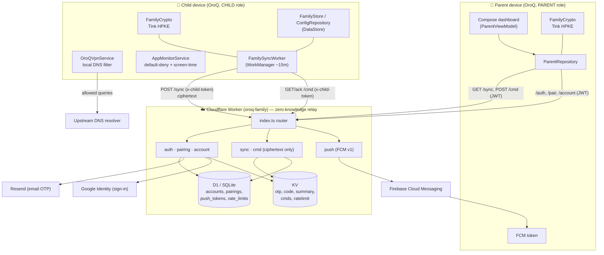
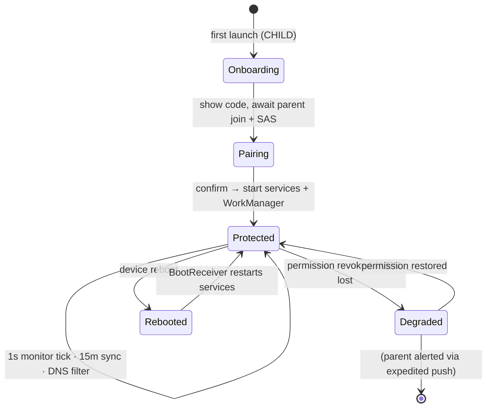

# OroQ — System Architecture

## 1. High-level diagram



## 2. The three tiers

### A. Child device — the enforcement engine
Everything that actually *protects* runs here, locally, with no dependency on the
network for enforcement:

- **`OroQVpnService`** (`vpn/`) establishes a local VPN that routes **only DNS**
  to an on-device resolver loop. `DnsFilter` (`filter/`) checks each query against
  category blocklists; blocked queries get a sinkhole response, allowed ones are
  forwarded to the upstream resolver over a protected socket. Browsing content
  never leaves the device; only the *domain* of a blocked query is logged.
- **`AppMonitorService`** (`monitor/`) polls the foreground app once per second
  and applies `decideBlock(...)` — a pure function with precedence:
  system-critical → default-deny (unapproved) → schedule window → blocked app →
  daily-limit. It shows `BlockActivity` when needed. Time comes from
  **`ClockGuard`** (monotonic anchor) so clock tampering can't skip curfews.
- **`FamilySyncWorker`** (`family/`) every ~15 min builds an activity summary,
  encrypts it for the parent, uploads it, and drains the parent command queue.
- **`BootReceiver`** (`boot/`) restarts the services after a reboot.

### B. Parent device — the control plane
Pure client of the backend, no enforcement:

- **`ParentViewModel` / `ParentRepository`** (`parent/`) fetch + decrypt the
  child's latest summary, derive dashboard stats (`Insights`,
  `ConfidenceScore`), and send encrypted commands.
- Compose screens: dashboard, activity timeline, devices, device-detail
  (per-child controls), more/settings.

### C. Cloudflare Worker — the zero-knowledge relay
Stateless request router (`index.ts`) over D1 + KV:

- **Account/auth/pairing** is the only place plaintext identity lives (parent
  email, pairing public keys, child-token hashes).
- **Sync/cmd** are opaque ciphertext stores keyed by `pairingId`; the Worker
  never decrypts.
- **Push** sends FCM alerts to the parent (e.g. a threat was blocked).

## 3. Layering inside the Android app

```
UI (Compose screens, Activities)
        │   observes
ViewModel (ParentViewModel)  ── state ──►  UI
        │   calls
Repository (ParentRepository) / Worker (FamilySyncWorker, AppMonitorService)
        │   uses
Domain  (FamilyCrypto, decideBlock, ClockGuard, DnsFilter, Insights)   ← pure, unit-tested
        │   persists / transports
Data    (FamilyStore, ConfigRepository = DataStore) · FamilyApi (HTTP) · KV/D1 (server)
```

Pure domain logic (`decideBlock`, `ClockGuard`, `DnsFilter`, `Insights`,
`FamilyCrypto`, summary/command (de)serialization) is isolated from Android/IO so
it is unit-tested without a device (~152 Android unit tests; 10 backend suites).

## 4. Process / lifecycle model (child)


