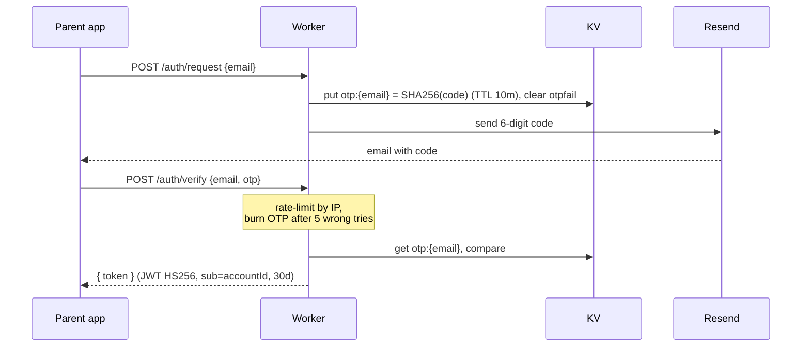
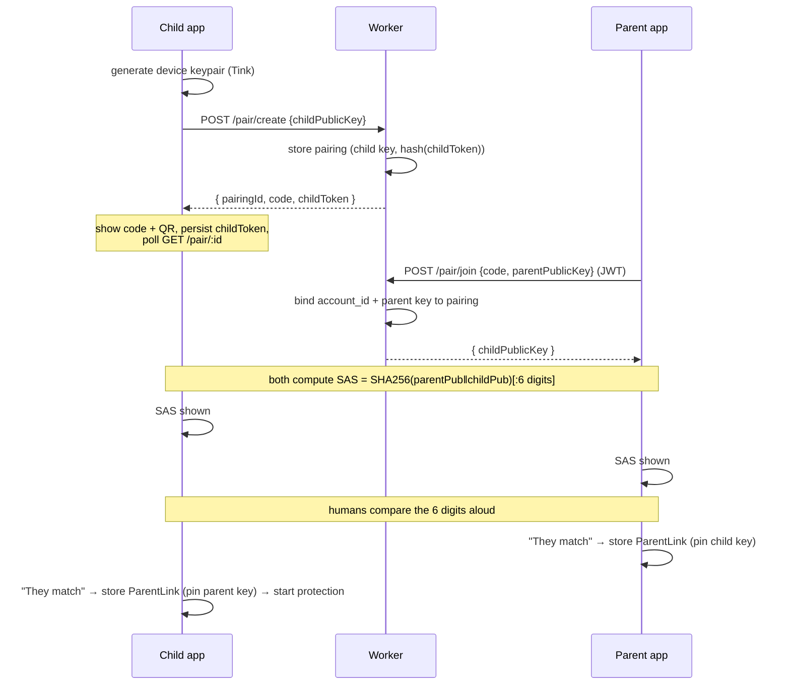
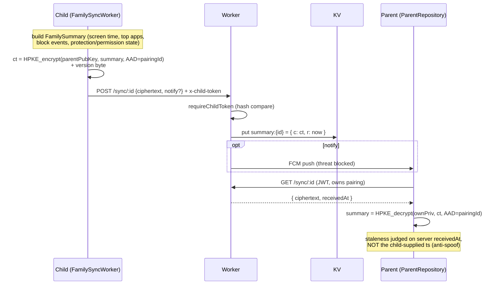
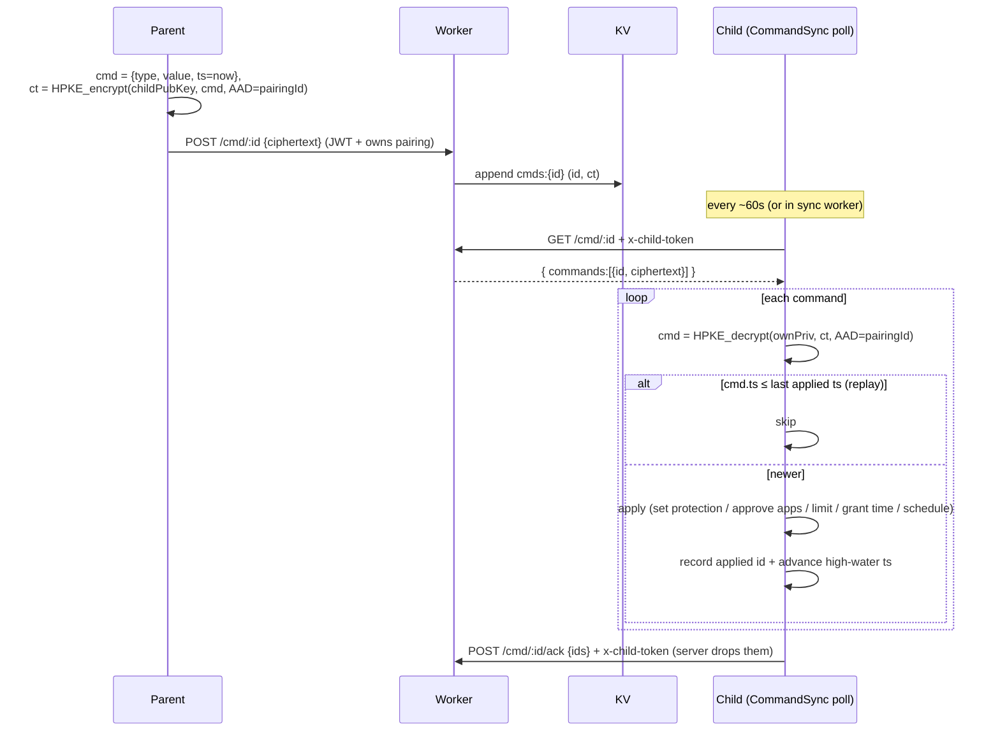
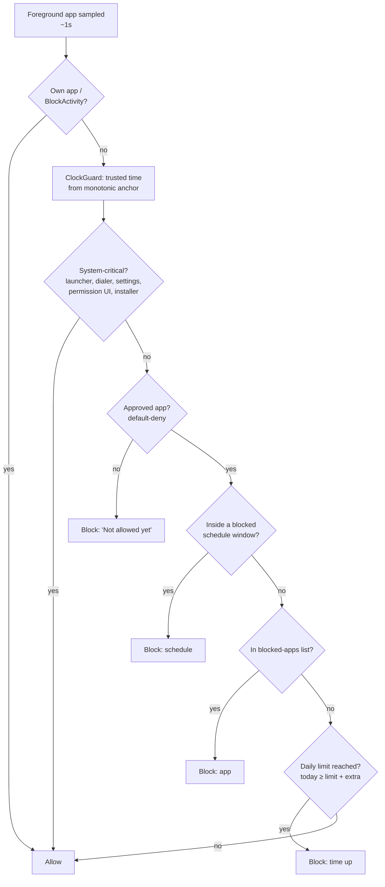
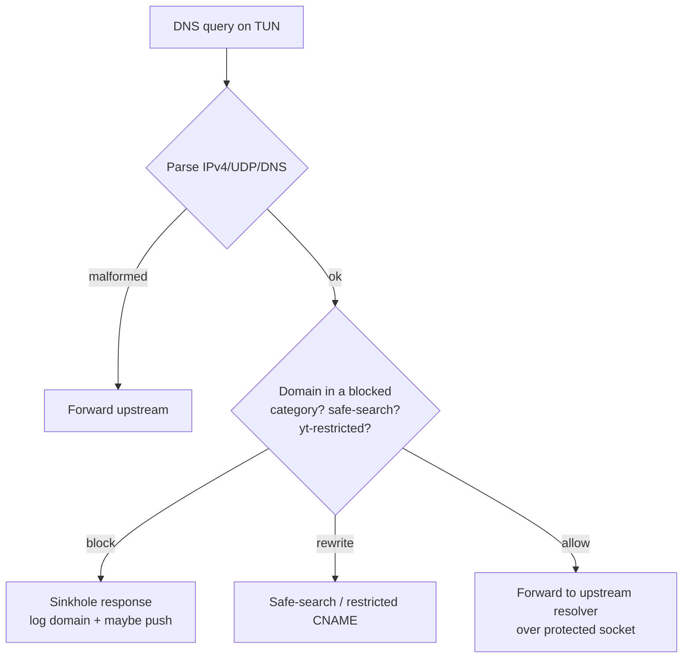
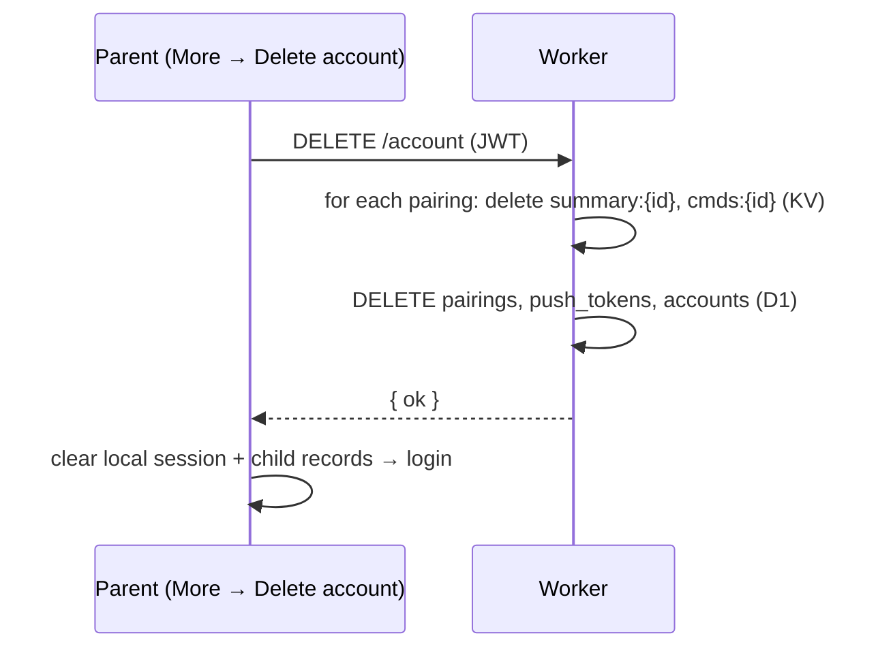

# OroQ — Key Flows

Sequence/flow diagrams for the core journeys. Participants:
**C** = child device, **P** = parent device, **W** = Worker, **D1/KV** = stores.

---

## 1. Parent authentication (email OTP)

Google sign-in is equivalent: `POST /auth/google {idToken, nonce}` → Worker
verifies the Google ID token (RS256 vs JWKS, `aud`/`iss`/`exp`/`nonce`) → same
session JWT. Accounts link by verified email.

---

## 2. Child-led pairing (with SAS)

**Why SAS:** the Worker relays the public keys, so a malicious relay could swap
them (MITM). The out-of-band human comparison detects a swap.

---

## 3. Activity sync (child → parent, E2E)

---

## 4. Remote command (parent → child, E2E + anti-replay)

Command types: `SET_PROTECTION`, `SET_CATEGORIES`, `SET_SAFE_SEARCH`,
`SET_YT_RESTRICTED`, `SET_BLOCKED_APPS`, `SET_APPROVED_APPS`, `SET_APP_SCHEDULE`,
`SET_DAILY_LIMIT`, `GRANT_EXTRA_TIME`.

---

## 5. On-device enforcement (child monitor tick)

And DNS filtering (VPN loop), independent of the above:

---

## 6. Account deletion (Play compliance)

